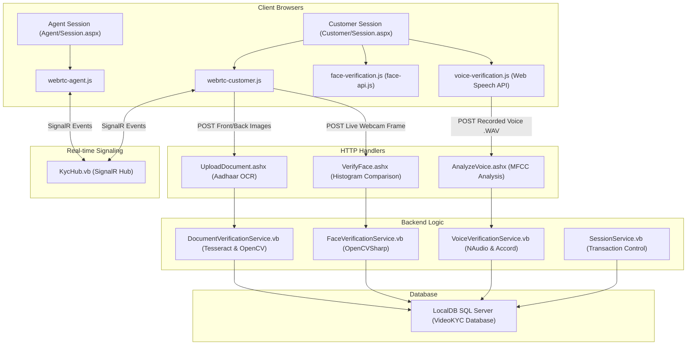

# Video KYC System — Local Setup & Testing Guide

This is a self-contained, high-fidelity **Video KYC (Know Your Customer) Platform** built using ASP.NET Web Forms, VB.NET, .NET Framework 4.8, SQL Server LocalDB, SignalR, and WebRTC. It features real-time WebRTC audio/video streaming, automated AI Document OCR extraction (Aadhaar, PAN, Passport, DL), biometric face matching, and voice verification.

---

## 🏗️ Architecture Overview

The system operates using a client-server architecture with real-time bidirectional signaling via ASP.NET SignalR, media streaming via peer-to-peer WebRTC, and backend verification processors:



---

## 🛠️ Technology Stack

1. **Frontend**: HTML5, Vanilla CSS (Custom Glassmorphic Styling), JavaScript (WebRTC, SignalR client, Web Speech API).
2. **Backend**: ASP.NET Web Forms, VB.NET, .NET Framework 4.8, Dapper (ORM), Newtonsoft.Json.
3. **Database**: SQL Server LocalDB (`(localdb)\MSSQLLocalDB`).
4. **Signaling**: Microsoft ASP.NET SignalR (WebSockets fallback).
5. **AI & Biometrics**:
   - **OCR Engine**: Tesseract OCR (`eng+hin` language models) & OpenCV (Image preprocessing, adaptive threshold binarization).
   - **QR Scanner**: ZXing.Net (decodes secure UIDAI QR codes on Aadhaar).
   - **Face Verification**: OpenCVSharp (Server-side Histogram comparison) & client-side Face-API.js.
   - **Voice Verification**: NAudio & Accord.NET (Backend 13 MFCC energy coefficient extraction) combined with Web Speech API (Client-side Levenshtein semantic similarity).

---

## 📋 System Requirements & Prerequisites

Before running the application locally, ensure your machine satisfies the following requirements:

### Hardware Requirements
* **Webcam & Microphone**: Necessary for both the customer (client side) and officer (agent side) to establish WebRTC media channels and execute voice verification.
* **Network**: Active Internet connection required for NuGet package restores and to fetch cloud-based acoustic engines utilized by the browser's native Web Speech API.

### Software Prerequisites
1. **Windows OS**: Required for .NET Framework 4.8 and SQL Server LocalDB.
2. **Visual Studio 2022** (Community/Professional/Enterprise) with workloads:
   - *ASP.NET and web development*
   - *Data storage and processing* (for SQL Server LocalDB)
3. **SQL Server LocalDB** (installed by default with VS).
4. **IIS Express** (standard for running Web Forms locally).
5. **Modern Browsers**: Google Chrome or Microsoft Edge (recommended) for native Web Speech API support. (Firefox/Brave require specific configurations, see [Troubleshooting](#-troubleshooting)).

---

## 🚀 Installation & Local Setup

Follow these step-by-step instructions to get the application running on your local device:

### 1. Restore NuGet Packages
Open Command Prompt or PowerShell in the project root directory (`C:\videokyc`) and run:
```cmd
nuget.exe restore
```
> [!NOTE]
> If you do not have `nuget` configured in your system environment variable path, a local executable `nuget.exe` is provided in the repository root. Run:
> ```cmd
> .\nuget.exe restore
> ```

### 2. Download AI Assets & Weights
The project relies on local models for Tesseract OCR extraction and client-side Face-API.js. Run the automated setup script to download them:
```powershell
powershell -ExecutionPolicy Bypass -File download_assets.ps1
```
This script automatically pulls and places:
- Tesseract trained data (`eng.traineddata`, `hin.traineddata`) into [App_Data/tessdata/](file:///c:/videokyc/App_Data/tessdata/).
- Face-api weights (manifests and binary shards) into [models/](file:///c:/videokyc/models/).

### 3. Initialize the Database
1. Make sure your local SQL Server instance is active. If it is stopped, run:
   ```cmd
   sqllocaldb start MSSQLLocalDB
   ```
2. Build the database structure and seed the default agent account using `sqlcmd`:
   ```cmd
   sqlcmd -S "(localdb)\MSSQLLocalDB" -i setup_db.sql
   ```
This creates the `VideoKYC` database with all required tables (Customers, Agents, KycSessions, DocumentVerifications, FaceVerifications, VoiceVerifications, KycAuditLog) and inserts the default agent credentials:
* **Username**: `officer1`
* **Password**: `password123`

### 4. Compile and Build the Project
You can build the project by either opening Visual Studio or executing the build pipeline via CLI.

#### Option A: CLI Build via MSBuild
Run MSBuild from a command prompt:
```cmd
"C:\Program Files\Microsoft Visual Studio\2022\Community\MSBuild\Current\Bin\MSBuild.exe" /t:Build /p:Configuration=Debug
```
*(Verify your Visual Studio installation edition/version if the MSBuild path differs).*

#### Option B: Visual Studio IDE
1. Open the folder `C:\videokyc` as a Website or double-click `VideoKYC.vbproj` to open the project.
2. Press `Ctrl + Shift + B` (or select **Build > Build Solution** from the top menu).

### 5. Launch the Local Dev Server
Use IIS Express configured to serve the directory on port **9000**:
```cmd
"C:\Program Files\IIS Express\iisexpress.exe" /path:"C:\videokyc" /port:9000
```
Open your browser and navigate to `http://localhost:9000`.

---

## 🖥️ Step-by-Step E2E Testing Walkthrough

Use the instructions below to run a complete, end-to-end simulated Video KYC session:

### Step 1: Open the Officer Queue Dashboard
1. Open Google Chrome/Edge and go to: `http://localhost:9000/Agent/Login.aspx`.
2. Login with the seeded credentials:
   - **Username**: `officer1`
   - **Password**: `password123`
3. Click **Login**. You will be redirected to [Agent/Queue.aspx](file:///c:/videokyc/Agent/Queue.aspx) showing the active queue dashboard.

### Step 2: Open a Separate Window for the Customer
1. To avoid cookie or session overlaps, open a **Private/Incognito Window** (or a different browser).
2. Go to: `http://localhost:9000/Customer/Register.aspx`.
3. Fill in the details:
   - **Full Name**: `Aun Kumar Azad`
   - **Phone**: `9876543210`
4. Click **Start Verification**. The customer enters the **Waiting Room** and is put in the queue.

### Step 3: Establish the WebRTC Audio/Video Connection
1. Switch back to the **Officer Queue Dashboard**.
2. Click **Refresh Queue**. You will see `Aun Kumar Azad` appear in the waiting table.
3. Click **Join Call**.
4. Both pages will prompt for **Camera and Microphone permissions**. Click **Allow** on both browsers.
5. Within 2-3 seconds, the peer-to-peer WebRTC connection will connect, and live streams for both the customer and agent will display.

### Step 4: Perform Document OCR Verification (Aadhaar Card)
1. On the **Officer control panel** (right side of the page), select **Aadhaar Card** from the document dropdown and click **Request Upload**.
2. On the **Customer page**, a document upload widget will render with two file boxes: **Front Side** and **Back Side**. Only image files (PNG, JPG, JPEG) are accepted.
3. **Upload Front Side**: Select a front Aadhaar card image. The client extracts the text and streams the file to the server. The customer's face will be auto-cropped, and the demographic details (Aadhaar number, DOB, Name) are verified.
4. **Upload Back Side**: Select a back Aadhaar card image. The backend OCR parses the file, extracts the Address and Pin Code, applies spelling filters, and merges the details.
5. **Verification Check**: The officer dashboard will update in real-time to show:
   - Consolidated extracted details (Aadhaar Number, DOB, PIN, Address).
   - Clean, side-by-side previews of both the front and back card images.
   - Any warning badges if OCR confidence is low.

### Step 5: Perform Biometric Face Match
1. Make sure the customer is looking directly at the camera.
2. In the **Officer control panel**, click **Capture Face**.
3. The system captures the live frame from the WebRTC stream and compares it with the cropped face image from the front Aadhaar card.
4. Two comparison checks are performed:
   - **Client-Side**: Face-api.js extracts facial descriptors to calculate similarity distance.
   - **Server-Side**: OpenCVSharp compares image histograms.
5. If the combined score exceeds **50%**, the status changes to a green checkmark indicating a biometric pass.

### Step 6: Execute Voice Verification
1. On the **Officer control panel**, go to the **Voice Challenge-Phrase** section.
2. Select a phrase from the dropdown list:
   - *"My name is Aun Kumar Azad"* (automatically populated with the customer's name)
   - *"I authorize this KYC process"*
3. Click **Voice Challenge**.
4. On the **Customer page**, the selected phrase will be displayed with a **Start Recording** button.
5. The customer clicks **Start Recording** and speaks the phrase clearly.
6. The system performs two operations:
   - **Speech-to-Text (STT)**: Transcribes the audio locally using the Web Speech API and calculates a Levenshtein distance semantic score (60% weight).
   - **Acoustic Analysis (MFCC)**: Records the `.wav` audio, uploads it to [Handlers/AnalyzeVoice.ashx](file:///c:/videokyc/Handlers/AnalyzeVoice.ashx), and uses NAudio + Accord to verify acoustic frequencies (40% weight) to prevent silence or static bypasses.
7. **Verification Check**: If the combined score is $\ge 70\%$, the officer dashboard displays a green status badge saying **"Voice Verified"**. If it is less than $70\%$, it displays a red badge saying **"Voice Not Verified"**.

### Step 7: Finalize Session Decision
1. Review the overall statuses on the agent page.
2. Enter review notes in the **Notes** textbox.
3. Click **Approve KYC** to approve, or **Reject KYC** (requires filling in a rejection reason) to deny.
4. The customer's session terminates, showing their final status.

---

## 🔍 Troubleshooting & FAQs

### 1. SQL LocalDB Connection Error
* **Symptom**: Page throws an exception: *"A network-related or instance-specific error occurred while establishing a connection to SQL Server."*
* **Solution**: Ensure LocalDB is installed and running:
  1. Open command line and check instances: `sqllocaldb info`
  2. Start the default instance: `sqllocaldb start MSSQLLocalDB`
  3. Re-run: `sqlcmd -S "(localdb)\MSSQLLocalDB" -i setup_db.sql`

### 2. Client-Side Face API Models Fail to Load
* **Symptom**: Dashboard console shows `Error loading face-api.js models: ...` or file paths return `404 Not Found` for `-shard1` or `.json` weight files.
* **Solution**: Ensure your IIS Express config contains mime-types for json and extensionless/uncommon extensions. The project includes these mappings inside [Web.config](file:///c:/videokyc/Web.config):
  ```xml
  <staticContent>
      <remove fileExtension=".json" />
      <mimeMap fileExtension=".json" mimeType="application/json" />
      <mimeMap fileExtension="-shard1" mimeType="application/octet-stream" />
  </staticContent>
  ```
  If hosting on full IIS, make sure the static file handler supports serving these files.

### 3. Voice verification returns 0% score or fails to capture
* **Symptom**: Web Speech API is not starting or recording fails.
* **Solution**:
  1. **Browser Compatibility**: The native Web Speech API requires internet access (for speech models) and works best on Chrome or Microsoft Edge.
  2. **Brave / Firefox settings**: In Brave, "Brave Shields" or fingerprint blocking can prevent Speech Recognition from starting. Turn off Shields for `localhost`. In Firefox, Speech recognition is disabled by default; search `media.webspeech.recognition.enable` and `media.webspeech.recognition.force_enable` in `about:config` and set them to `true`.
  3. **Microphone Access**: Ensure the page is granted microphone permissions.

### 4. WebRTC Connection fails (Stuck at connecting)
* **Symptom**: The agent and customer join, but video feeds remain black and spinner does not disappear.
* **Solution**:
  1. Ensure both devices are running on the same network or on the same localhost server.
  2. SignalR is required to exchange ICE candidates. Check the browser developer console (`F12`) for any JavaScript or SignalR connection errors.
  3. Verify that the ports are not blocked by a firewall.

---

## 📁 Key File Map

| File Path | Description |
| :--- | :--- |
| **[App_Data/tessdata/](file:///c:/videokyc/App_Data/tessdata/)** | Contains Tesseract OCR language training sets (`eng.traineddata`, `hin.traineddata`). |
| **[models/](file:///c:/videokyc/models/)** | Contains client-side Face-API.js neural network weights. |
| **[Agent/Session.aspx](file:///c:/videokyc/Agent/Session.aspx)** | Officer WebRTC workspace interface page. |
| **[Customer/Session.aspx](file:///c:/videokyc/Customer/Session.aspx)** | Customer WebRTC workspace interface page. |
| **[Scripts/webrtc-agent.js](file:///c:/videokyc/Scripts/webrtc-agent.js)** | Manages Agent SignalR events, WebRTC negotiations, and UI updates. |
| **[Scripts/voice-verification.js](file:///c:/videokyc/Scripts/voice-verification.js)** | Captures voice, starts Web Speech API recognizer, handles WAV recording, and posts data. |
| **[Handlers/UploadDocument.ashx.vb](file:///c:/videokyc/Handlers/UploadDocument.ashx.vb)** | Handles document uploads, runs OCR, and updates the database records. |
| **[Handlers/AnalyzeVoice.ashx.vb](file:///c:/videokyc/Handlers/AnalyzeVoice.ashx.vb)** | Runs backend acoustic frequency checks on uploaded voice recordings. |
| **[Components/Hubs/KycHub.vb](file:///c:/videokyc/Components/Hubs/KycHub.vb)** | SignalR communications hub for WebRTC SDP exchange and session status sync. |
