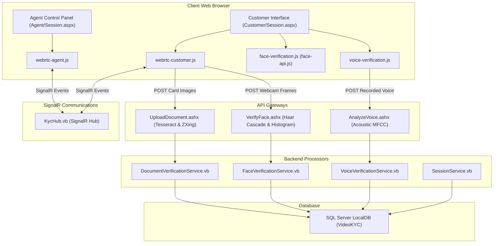

# High-Fidelity Video KYC Platform

A self-contained, real-time **Video KYC (Know Your Customer) Platform** built using ASP.NET Web Forms, VB.NET (.NET Framework 4.8), SQL Server, SignalR, and WebRTC. It enables secure, automated candidate verification through multi-modal biometrics and OCR analysis.

---

## 🚀 Key Features

* **Real-Time WebRTC Media Streaming**: Full-duplex audio/video communication directly between the customer and the officer, complete with early-candidate ICE queuing to prevent connection drops.
* **Automated Document OCR & Verification**: real-time demographic extraction (Name, DOB, PIN, Address) from Aadhaar and PAN card uploads utilizing **Tesseract OCR** and **OpenCV** image processing.
* **Secure QR Scanning**: Decodes secure UIDAI QR codes on Aadhaar cards using **ZXing.Net** to prevent tampering.
* **Rotation-Robust Biometric Face Match**: Automatically detects, rotates, and crops the customer's face from sideways/portrait document uploads and live webcam frames using **OpenCV Haar Cascades** on the server and **face-api.js** on the client.
* **Hybrid Voice Verification**: Combines browser-based Web Speech API (transcription semantic accuracy) with backend acoustic frequency check (**NAudio & Accord.NET MFCC energy coefficient analysis**) to block static/synthesized voice bypasses.
* **Officer Queue & History**: Real-time queue claiming dashboard, green connection/reconnection alerts, and an approved KYC history portal.

---

## 🏗️ Architecture & Flow

The system runs on a client-server model using SignalR for SDP/ICE negotiations, peer-to-peer WebRTC for media flows, and HTTP Ashx Handlers for file/biometric uploads.



---

## 🛠️ Technology Stack

* **Frontend**: HTML5, CSS3 (Custom Glassmorphic Styling), JavaScript (WebRTC, SignalR Client, Web Speech API).
* **Backend**: ASP.NET Web Forms, VB.NET, Dapper ORM, Newtonsoft.Json.
* **Signaling**: ASP.NET SignalR (WebSockets / Server-Sent Events).
* **Database**: SQL Server LocalDB.
* **Libraries**: OpenCVSharp4, Tesseract.NET, ZXing.Net, NAudio, Accord.NET (Audio & Math).

---

## ⚡ Quick Start Local Setup

Follow these steps to set up and run the Video KYC Platform on your local Windows machine:

### 1. Restore Project Dependencies
Open your command terminal in the project root directory and restore the NuGet packages:
```cmd
.\nuget.exe restore
```

### 2. Download AI Assets & Weights
The project relies on local models for Tesseract OCR and client-side Face-API.js. Run the download script to fetch and place them automatically:
```powershell
powershell -ExecutionPolicy Bypass -File download_assets.ps1
```

### 3. Initialize SQL Server LocalDB Database
1. Make sure your local SQL Server instance is active. If it is stopped, start it:
   ```cmd
   sqllocaldb start MSSQLLocalDB
   ```
2. Build the database structure and seed the default agent credentials using `sqlcmd`:
   ```cmd
   sqlcmd -S "(localdb)\MSSQLLocalDB" -i setup_db.sql
   ```

### 4. Build & Run via Visual Studio
1. Open the solution file `VideoKYC.sln` in **Visual Studio 2022** (or higher).
2. Ensure the configuration target is set to **Debug** (Any CPU).
3. Press **F5** (or click the **IIS Express** play button at the top menu) to compile the codebase and launch the local development server.
4. Your browser will launch automatically. You can access the interfaces using:
   * **Customer Registration**: `http://localhost:9000/Customer/Register.aspx`
   * **Officer Dashboard Login**: `http://localhost:9000/Agent/Login.aspx`
     * **Username**: `officer1`
     * **Password**: `password123`

---

## 📁 Key File Map

| File Path | Description |
| :--- | :--- |
| **[Agent/Queue.aspx](file:///c:/videokyc/Agent/Queue.aspx)** | Officer queue dashboard and approved KYC history panel. |
| **[Agent/Session.aspx](file:///c:/videokyc/Agent/Session.aspx)** | Officer control room workspace (verifications panel). |
| **[Customer/Session.aspx](file:///c:/videokyc/Customer/Session.aspx)** | Customer-facing video stream and document upload portal. |
| **[Scripts/webrtc-agent.js](file:///c:/videokyc/Scripts/webrtc-agent.js)** | Agent-side SignalR events, WebRTC negotiations, and UI updates. |
| **[Scripts/face-verification.js](file:///c:/videokyc/Scripts/face-verification.js)** | Performs client-side face-api checks with auto-rotation support. |
| **[Handlers/UploadDocument.ashx.vb](file:///c:/videokyc/Handlers/UploadDocument.ashx.vb)** | Handles document uploads, runs OCR, and extracts printed photos. |
| **[Handlers/VerifyFace.ashx.vb](file:///c:/videokyc/Handlers/VerifyFace.ashx.vb)** | Crops live webcam face and performs OpenCV histogram similarity check. |
| **[Handlers/AnalyzeVoice.ashx.vb](file:///c:/videokyc/Handlers/AnalyzeVoice.ashx.vb)** | Runs combined STT + MFCC acoustic validation and inserts verified records. |
| **[Components/Hubs/KycHub.vb](file:///c:/videokyc/Components/Hubs/KycHub.vb)** | SignalR communications hub for WebRTC SDP exchange and real-time state sync. |
